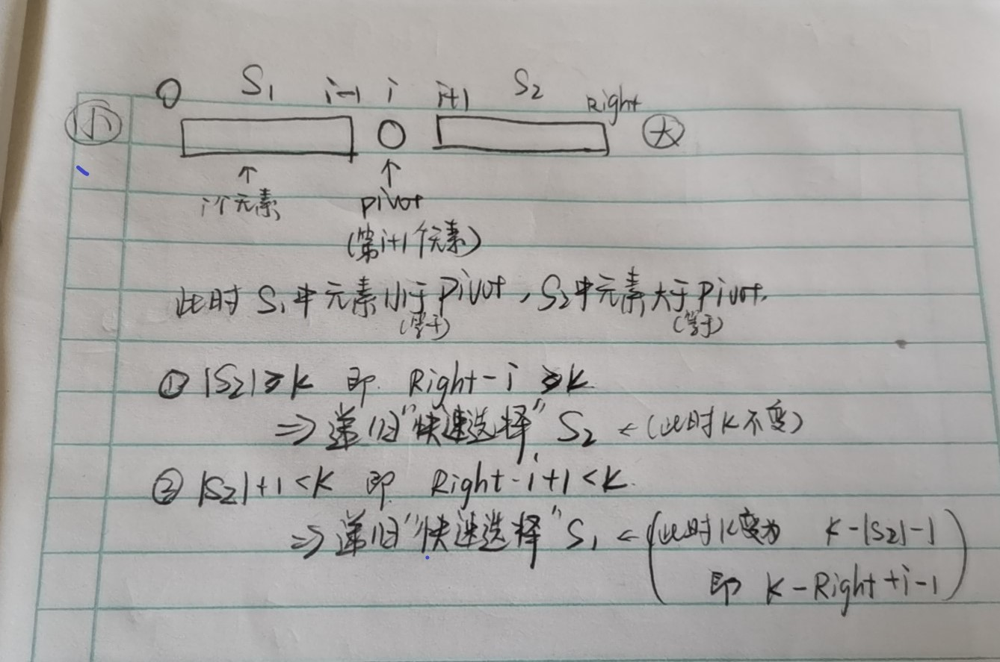

# Leetcode-Sort

## 希尔排序

缩小增量排序。通过比较相距一定间隔的元素来进行部分的排序，这样的比较和交换可以一次性消除若干个逆序对，以提高程序效率。

通常使用一个增量序列(增量序列的好坏影响排序效率):h<sub>1</sub>,h<sub>2</sub>>,....,h<sub>t</sub>>。如果对于一组数据，所有相隔h<sub>k</sub>的元素都是有序的，那么称为是h<sub>k</sub>-排序的。对于希尔排序，最关键的特性是，h<sub>k</sub>-排序的文件(若此后的增量比h<sub>k</sub>小的h<sub>k</sub>-话)，会保持它的h<sub>k</sub>-排序性。

而在程序内部通过插入排序的方法来避免过多的两两交换。

对于增量序列有三种主要的选择:

①Shell序列: h<sub>t</sub>=N/2 和 h<sub>k</sub>=h<sub>k+1</sub>/2  (流行但是不好。潜在的问题是，增量序列可能不是互素的，因此较小的增量可能对于排序作用不明显，可能会做很多无用功)

②Hibbard序列：1,3,7,...,2<sup>k</sup>-1    （由于这个序列是互素的，因此在理论上和实践上会有更好的效果）

③SedgeWick序列：{1,5,19,41,109,...} 该序中的项为 9×4<sup>i</sup>-9×2<sup>i</sup>+1 或者 4<sup>i</sup>-3×2<sup>i</sup>+1 (该序列在实践中被认为效果很好)

```c
//基于Shell序列的希尔排序
void Shellsort( ElementType A[],int N)
{
    int i,j, Increment;
    ElementType Tmp;
    for(Increment=N/2; Increment>0; Increment /= 2)
        for(i=Increment; i<N; i++)   //插入排序
        {
            Tmp=A[i];
            for(j=i; j>=Increment; j-=Increment)
                if(Tmp<A[j-Increment])
                    A[j]=A[j-Increment];
                else 
                    break;
            A[j]=Tmp;
        }
}
```


## 堆排序

给定一个数组，若按小到大排序。可使用堆排序。分为两步:①BuildHeap 把数组构建成一个max堆 ；②DeleteMax 在这个过程中，把最后一个元素和第一个元素交换位置，然后把堆的大小减一(即最后一个元素就视为不在堆的内部了)，然后把第一个元素下滤，这样剩下的元素依旧是一个max堆，但是原最大的元素已经位于数组的最后一个位置。重复这个过程就可以实现排序。

```c
#define LeftChild(i) (2*(i)-1)   //i结点的左儿子的下标 (这样计算是因为数组下标是从0开始而不是1开始)
void PercDown(ElementType A[], int i, int N)
{
    int Child;
    ELementType tmp;
    for(tmp=A[]; LeftChild(i)<N; i=Child)
    {
        Child=LeftChild(i);
        if(Child!=N-1 && A[Child+1]>A[Child])
            Child++;
        if(tmp<A[Child])
            A[i]=A[Child];
        else 
            break;
    }
    A[i]=tmp;
}
void Heapsort(ElementType A[],int N)
{
    int i;
    for(i=N/2; i>=0; i--)   /*BuildHeap*/
        PercDown(A,i,N);
    for(i=N-1;i>0; i--)     /*DeleteMax*/
    {
        Swap(&A[0],&A[i]); 
        PercDown(A,0,i);
    }
}
```


### 215.数组中的第k个最大元素

```c
//使用堆排序，先把所给的数组构建成一个max堆，然后用k次的deleteMax来取出第k个最大的元素
#define LeftChild(i) (2*(i)+1) //i结点的左儿子的下标
void PercDown(int* nums,int i,int N);
void BuildHeap(int* nums, int N);
void MydeleteMaxForK(int* nums,int k,int N);
void Swap(int* i,int *j);
int findKthLargest(int* nums, int numsSize, int k){
    BuildHeap(nums,numsSize);
    MydeleteMaxForK(nums,k,numsSize);
    return nums[numsSize-k];
}
//max堆的下滤函数 要用于BuildHeap 和 deleteMax
void PercDown(int* nums,int i,int N)  //i为当前要下滤的结点  N为总的结点个数
{
    int Child,tmp;
    for(tmp=nums[i]; LeftChild(i)<N;i=Child)  //LeftChild(i)<N 确保了该节点不是叶结点(即至少有左儿子)
    {
        Child=LeftChild(i);
        if(Child!=N-1 &&nums[Child+1]>nums[Child]) //这里的顺序不能换 第一个表达式判断下一个结点是否存在(即父节点的右儿子) 
           Child++;       // 然后找出父节点的左右儿子中较大的那个(即 如果右儿子比左儿子大 就把Child++)
        if(tmp<nums[Child])    //如果要下滤的结点小的话就把 Child的结点向上移一个位置
           nums[i]=nums[Child];
        else 
           break;   //如果下滤的结点比Child大 那么下滤过程结束  break出去然后把当前的结点赋值tmp        
    }
    nums[i]=tmp;
}
void BuildHeap(int* nums, int N)   //创建max堆
{
    int i;
    for(i=N/2; i>=0; i--)   //从最后一个结点的父节点开始到第一个结点  逐个调用下滤函数 即构建了一个
       PercDown(nums,i,N);
}
void MydeleteMaxForK(int* nums,int k,int N)  //这里把最大元素放到堆的最后一个位置，然后把堆的大小减一，那么执行k次后，堆的倒数第k个位置的元素就是第k个最大元素
{
    int i;
    for(i=N-1; i>0&&k>0; i--,k-- )
    {
        Swap(&nums[0],&nums[i]);  //把最大的元素和最后一个元素交换位置
        PercDown(nums,0,i);   //i每次减一 实现了在每次下滤时 堆的大小减一
    }
}
void Swap(int* i,int *j)
{
    int temp=*i;
    *i=*j;
    *j=temp;
}
```

## 归并排序

归并排序的基础就是Merge，用于把两个有序数组合并。基于此，若给定一个数组，对其排序时，可以把它分为前后两部分，如果这两部分有序了，那么把他们Merge就可以了。对于前后两部分，又可以通过递归做同样的操作。(到最后左右两部分各只有一个元素，即有序，就停止递归)

```c
//若已知数组前后两半部分分别有序，那么把他们合并并存在一个临时数组中，然后再复制回去
/*Lpos=start of left half, Rpos=start of right half*/
void Merge(ElementType A[], ElementType TmpArray[],int Lpos, int Rpos,int RightEnd)
{
    int i,LeftEnd,NumsElements,TmpPos;
    LeftEnd=Rpos-1;
    TmpPos=Lpos;
    NumElements=RightEnd-Lpos+1;
    /*main loop*/
    while(Lpos<=LeftEnd && Rpos<=RightEnd)
        if(A[Lpos]<A[Rpos])
            TmpArray[TmpPos++]=A[Lpos++];
        else 
            TmpArray[TmpPos++]=A[Rpos++];
    while(Lpos<=LeftEnd)  /*Copy rest of first half*/
        TmpArray[TmpPos++]=A[Lpos++];
    while(Rpos<=RightEnd) /*Copy rest of right half*/
        TmpArray[TmpPos++]=A[Rpos++];
    /*Copy TmpArray back*/
    for(i=0;i<NumElements; i++,RightEnd--)
        A[RightEnd]=TmpArray[RightEnd];
} 
```

下面是归并排序例程

```c
void MSort(ElementType A[], ElementType TmpArray[],int left,int right)
{
    int Center;
    if(left<right)
    {
        Center=(left+right)/2;
        Msort(A,TmpArray,left,Center);
        Msort(A,TmpArray,Center+1,right);
        Merge(A,TmpArray,left,Center+1,right);
    }
}
void Mergesort(ElementType A[],int N)
{
    ElementType* TmpArray;
    TmpArray=malloc(N*sizeof(ElementType));
    if(TmpArray!=NULL)
    {
        Msort(A,TmpArray,0,N-1);
        free(TmpArray);
    }
    else 
        FatalError("No space for tmp array!!!");
}
```

注意，这里Mergesort主例程中，使用了malloc来申请临时数组，并且在程序结束时才free。而没有选择在递归程序内部申请，因为若在递归程序中申请数组，会需要许多次的malloc和free操作，会花费更多的时间。

### 88.合并两个有序数组

并不是归并排序，但是合并两个有序数组是归并排序的基本操作，使用三个指针来实现。(基本等同于Merge)

```c
void merge(int* nums1, int nums1Size, int m, int* nums2, int nums2Size, int n){
    int i=0,j=0,cur=0;
    int* temp=(int*)malloc(m*sizeof(int));
    for(i=0;i<m;i++)  //把nums1中的值移动到临时数组中
       temp[i]=nums1[i];
    i=0;
    while(i<m&&j<n)
    {
        if(temp[i]<nums2[j])
            nums1[cur++]=temp[i++];
        else
            nums1[cur++]=nums2[j++];
    }
    while(i<m)
       nums1[cur++]=temp[i++];
    while(j<n)
       nums1[cur++]=nums2[j++];
    free(temp);
}
```

### [剑指offer51]数组中的逆序对

在归并排序Merge的过程中count逆序对的个数。

思路(来自Leetcode官方题解)：

假设我们有两个已排序的序列等待合并，分别是 L = \{ 8, 12, 16, 22, 100 \}L={8,12,16,22,100} 和 R = \{ 9, 26, 55, 64, 91 \}R={9,26,55,64,91}。一开始我们用指针 lPtr = 0 指向 L的首部，rPtr = 0 指向 R的头部。记已经合并好的部分为 M。

```c
L = [8, 12, 16, 22, 100]   R = [9, 26, 55, 64, 91]  M = []
     |                          |
   lPtr                       rPtr
```

​    我们发现 lPtr 指向的元素小于 rPtr 指向的元素，于是把 lPtr 指向的元素放入答案，并把 lPtr 后移一位。

```c
L = [8, 12, 16, 22, 100]   R = [9, 26, 55, 64, 91]  M = [8]
        |                       |
      lPtr                     rPtr
```


这个时候我们把左边的 8 加入了答案，我们发现右边没有数比 8 小，所以 8 对逆序对总数的「贡献」为 0。

接着我们继续合并，把 9 加入了答案，此时 lPtr 指向 12，rPtr 指向 26。

```c
L = [8, 12, 16, 22, 100]   R = [9, 26, 55, 64, 91]  M = [8, 9]
        |                          |
       lPtr                       rPtr
```


此时 lPtr 比 rPtr 小，把 lPtr 对应的数加入答案，并考虑它对逆序对总数的贡献为 rPtr 相对 RR 首位置的偏移 1（即右边只有一个数比 12 小，所以只有它和 12 构成逆序对），以此类推。

我们发现用这种「算贡献」的思想在合并的过程中计算逆序对的数量的时候，只在 lPtr 右移的时候计算，是基于这样的事实：当前 lPtr 指向的数字比 rPtr 小，但是比 RR 中 [0 ... rPtr - 1] 的其他数字大，[0 ... rPtr - 1] 的其他数字本应当排在 lPtr 对应数字的左边，但是它排在了右边，所以这里就贡献了 rPtr 个逆序对。

```c
//做题时，要注意左右指针指向元素相等的情况，因为相等的时候是不计入逆序对个数的
int count=0;
void Merge(int* nums,int* TmpArray,int Lpos,int Rpos, int RightEnd);
void Msort(int* nums,int* TmpArray,int Left,int Right);
int reversePairs(int* nums, int numsSize){
    count=0;
    int* TmpArray=(int*)malloc(numsSize*sizeof(int));
    if(TmpArray!=NULL)
    {
        Msort(nums,TmpArray,0,numsSize-1);
        free(TmpArray);
    }
    return count;
}
void Merge(int* nums,int* TmpArray,int Lpos,int Rpos, int RightEnd)
{
    int i,LeftEnd,NumsElements,TmpPos;
    LeftEnd=Rpos-1;
    TmpPos=Lpos;
    NumsElements=RightEnd-Lpos+1;
    while(Lpos<=LeftEnd&&Rpos<=RightEnd)
    {
        if(nums[Lpos]<=nums[Rpos]) //注意这里是小于等于 因为相等的情况是不累计逆序对个数的
        {
            TmpArray[TmpPos++]=nums[Lpos++];
            count += (Rpos-LeftEnd-1);   //累计逆序数 减一是因为Rpos指向数是大于Lpos指向的数的，因此这一对不构成逆序对
        }
        else 
           TmpArray[TmpPos++]=nums[Rpos++];
    }
    while(Lpos<=LeftEnd)
    {
        TmpArray[TmpPos++]=nums[Lpos++];
        count += (Rpos-LeftEnd-1);   //累计逆序数  不减一是因为 右半部分已经遍历完了 所有数都和当前和Lpos对应的数够成逆序对
    }
    while(Rpos<=RightEnd)
        TmpArray[TmpPos++]=nums[Rpos++];
    for(i=0;i<NumsElements; i++,RightEnd--)
    {
        nums[RightEnd]=TmpArray[RightEnd];
    }
}
void Msort(int* nums,int* TmpArray,int Left,int Right)
{
    int Center;
    if(Left<Right)
    {
        Center=(Left+Right)/2;
        Msort(nums,TmpArray,Left,Center);
        Msort(nums,TmpArray,Center+1,Right);
        Merge(nums,TmpArray,Left,Center+1,Right);
    }
}
```


## 快速排序

### 快速排序实现方法

类似归并排序，快速排序也是一种分治的递归算法。快速排序的基本思想是，对于给定的数据集合，选出一个元素作为枢纽元，然后把原集合(除枢纽元外) 分为小于(等于)枢纽元的集合S1和大于(等于)枢纽元的集合S2,然后依此递归。但通常会设置一个Cutoff，适合当递归到的数组规模小到一个限定值Cutoff(N=10是一个不错的选择)的时候，就用插入排序来代替递归，以提高程序的效率。

那么对于快速排序，主要的问题就是如何选择枢纽元，枢纽元的选择会决定程序的运行效率。(一种极端的情况是:假设所给的数据已经有序，然后对其快速排序，每次取第一个元素为枢纽元，那么每次S1就是空集，S2集合内就是除枢纽元外的其他元素，这样程序的运行时间是O(N^2))。为了避免这种极端的情况，应该选择尽量位于数据中间位置的元素为枢纽元，但这个选择的过程不能消耗太多时间，否则得不偿失。常用的办法就是三数中值分割法，取第一个，最中间和最后一个元素，这三个元素的中间值，通常在取值的同时还会把这三个元素排序(即最小的放在第一个，最大的放在最后一个，中间值放在倒数第二个位置并且返回)。

 注:这里把枢纽元放在倒数第二个位置，是因为枢纽元本身的位置还没有确定，因为集合还没有被划分，因此把枢纽元放在倒数第二个位置后，可以从第一个元素到倒数第三个元素，把他们划分为小于等于和大于等于枢纽元的两部分，然后再把枢纽元移到分界的位置上，

```c
ElementType Median3( ElementType A[], int left, int right )  //三数中值分割法
{
    int Center=（left+right)/2;
    if(A[left]>A[Center])             //left Center right三个位置上的数排序
        swap(&A[left],&A[Center]);
    if(A[left]>A[right])
        swap(&A[left],&A[right]);
    if(A[Center]>A[right]);
        swap(&A[Center],&A[right]);
    swap(&A[left],&A[right-1]);      //把枢纽元移到倒数第二个位置上(因为最后一个位置的元素已知大于等于枢纽元，所以必定在枢纽元右边)
    return A[right-1];
}
```

经过了上面的处理，接下来就是要先把数组分为S1，pivot，S2的顺序，然后递归。

分数组的方法是从用双指针(即数组下标)，++i从第二个元素开始向后遍历，--j从倒数第三个元素开始向前遍历，i遇到大于等于pivot的元素就停下来，j遇到小于等于pivot的元素就停下来，若此时i<j，则把这两个元素交换，然后继续遍历，循环直到i>=j。

最后i就会停在第一个大于等于pivot的元素上，然后把下标为i的元素和pivot元素交换位置，那么就完成了分数组的任务。

```c
#define Cutoff (3)
void Qsort(ElementType A[],int left,int right)
{
    int i,j;
    ElementType pivot;
    if(left+Cutoff<=Right)
    {
        pivot=Median3(A,left,right);
        i=left;j=right-1;
        for(;;)
        {
            while(A[++i]<pivot){ }  //因为第一个元素已经小于了pivot，并且倒数第二个元素就是pivot所以就从第二个和
            while(A[--j]>pivot){ }  //倒数第三个元素开始遍历
            if(i<j)
                swap(&A[i],&A[j]);
            else 
                break;
        }
        swap(&A[i],&A[right-1]);
        Qsort(A,left,i-1);
        Qsort(A,i+1,right);
    }
    else 
        InsertionSort(A+left,right-left+1);
}
void InsertionSort(ElementType A[],int N)  //插入排序
{
    int i,j;
    ElementType tmp;
    for(i=1;i<N;i++)
    {
        tmp=A[i];
        for(j=i;j>0 && A[j-1]>tmp; j--)
            A[j]=A[j-1];
        A[j]=tmp;
    }
}
```


### 快速选择

#### 215题快速选择方法实现

快速选择，基于快速排序的选择方法，前面基本上和快速排序相同。
这里通过快速选择把第K大的元素放在倒数第K个位置上。(并没有把整个数组排序)
1.使用Cutoff,当小数组的元素个数<=Cutoff的时候，使用插入排序代替继续递归，来提高效率。
2.使用三数中值的方法来选取枢纽元
3.分治处理的时候，相比快速排序有所调整。如果S2中元素个数大于等于k，那么所找元素在S2中，那么递归调用S2部分；如果S2中元素个数+1小于k，那么所找元素在S1中，那么递归调用S1部分；否则第K个最大元素就已经在倒数第K个位置上了(即枢纽元的位置)



```c
#define Cutoff (3)
void swap(int* i,int* j);
int Median3(int* nums,int left,int right);
void Qselect(int* nums,int k,int left,int right);
void InsertionSort(int* nums,int N);
int findKthLargest(int* nums, int numsSize, int k){
    Qselect(nums,k,0,numsSize-1);
    return nums[numsSize-k];
}
void swap(int* i,int* j)
{
    int temp=*i;
    *i=*j;
    *j=temp;
}
int Median3(int* nums,int left,int right)  //三数中值分割方法
{
    int Center=(left+right)/2;
    if(nums[left]>nums[Center])           //把左中右三值移动位置 左《中《右   同时下标为Center的元素就是中位数，即枢纽元
       swap(&nums[left],&nums[Center]);
    if(nums[left]>nums[right])
       swap(&nums[left],&nums[right]);
    if(nums[Center]>nums[right])
       swap(&nums[Center],&nums[right]);
    swap(&nums[Center],&nums[right-1]);   //把枢纽元放到right-1的位置
    return nums[right-1];
}
void Qselect(int* nums,int k,int left,int right)
{
    int i,j;
    int pivot;
    if(left+Cutoff<=right)
    {
        pivot=Median3(nums,left,right);
        i=left;j=right-1;
        for(;;)
        {
            while(nums[++i]<pivot){ }
            while(nums[--j]>pivot){ }
            if(i<j)
               swap(&nums[i],&nums[j]);
            else 
               break;
        }
        swap(&nums[i],&nums[right-1]);
        //上面和快速排序相同
        if(right-i>=k)   //|S2|>=k  递归调用右半边
           Qselect(nums,k,i+1,right);
        else if(right-i+1<k)  //|S2|+1<k  递归调用左半边
           Qselect(nums,k-right+i-1,left,i-1);      
    }
    else 
        InsertionSort(nums+left,right-left+1);   //对于小数组使用插入排序来提高效率
}
void InsertionSort(int* nums,int N)    //插入排序
{
    int i,j,tmp;
    for(i=1;i<N;i++)
    {
        tmp=nums[i];
        for(j=i;j>0&&nums[j-1]>tmp;j--)
           nums[j]=nums[j-1];
        nums[j]=tmp;
    }
}
```

