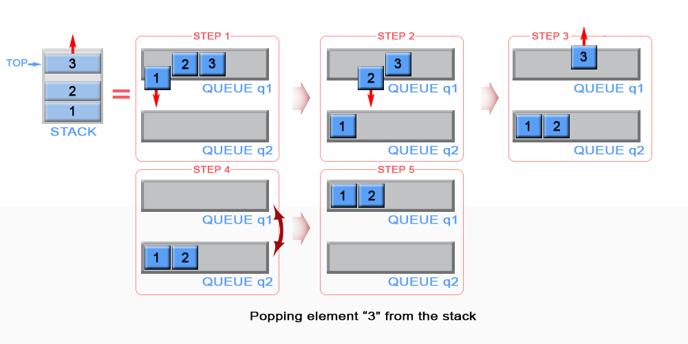

# Leetcode 栈&队列 专题

## 目录

[232.用栈实现队列](#A1)

[225.用队列实现栈](#A2)

[155.最小栈](#A3)

[20.有效的括号](#A4)

[739.每日温度](#A5)

[503.下一个更大元素](#A6)


## <span id="A1">232.用栈实现队列</span>

栈的顺序为后进先出，而队列的顺序为先进先出。使用两个栈实现队列，元素入栈时，利用两个栈把元素放入栈底，这样就实现了，先进先出。[此方法是入栈是利用两个栈，出栈时直接pop；也可入栈时直接push,出栈时利用两个栈，把最底下的元素取出来]


对应的出队直接pop即可


```c
//思路:队列是先进先出的，而栈是先进后出的，所以利用两个栈来实现队列
//入队列时需要把元素放到栈底(这样才能后出)，于是把S1中元素先反转放在S2中，再入栈，然后把S2中元素再反转放回来
//出队列时直接pop即可
#define MAXSIZE 100
struct Stack{             //用数组来实现栈
    int data[MAXSIZE];
    int top;
};
typedef struct {         //队列定义为双栈
    struct Stack S1;     //S1为主栈
    struct Stack S2;     //S2用来反转
} MyQueue;

/** Initialize your data structure here. */
MyQueue* myQueueCreate() {
    MyQueue* TempQueue= (MyQueue*)malloc(sizeof(MyQueue));
    TempQueue->S1.top=-1;           //不能用TempQueue->S1->top=-1; 会报错
    TempQueue->S2.top=-1;
    return TempQueue;
}

/** Push element x to the back of queue. */
void myQueuePush(MyQueue* obj, int x) {
    if(obj->S1.top<MAXSIZE)   //判断队列是否满了
    {
        while(obj->S1.top!=-1)    //把S1中元素反转放入S2中
        {
            obj->S2.data[++(obj->S2.top)]=obj->S1.data[(obj->S1.top)--];
        }
        obj->S1.data[++(obj->S1.top)]=x;     //把新元素压入S1中
        while(obj->S2.top!=-1)     //再把S2中元素反转压入S1中
        {
            obj->S1.data[++(obj->S1.top)]=obj->S2.data[(obj->S2.top)--];  
        }
    }
}

/** Removes the element from in front of queue and returns that element. */
int myQueuePop(MyQueue* obj) {
    if(obj->S1.top!=-1)
       return obj->S1.data[(obj->S1.top)--];
    return NULL;
}

/** Get the front element. */
int myQueuePeek(MyQueue* obj) {
    if(obj->S1.top!=-1)
       return obj->S1.data[obj->S1.top];
    return NULL;
}

/** Returns whether the queue is empty. */
bool myQueueEmpty(MyQueue* obj) {
    if(obj->S1.top==-1) return true;
    return false;
}

void myQueueFree(MyQueue* obj) {
    free(obj);
}
```

## <span id="A2">225.用队列实现栈</span>

与用栈实现队列相似，用了两个栈，这里用到的方法，在入栈的时候直接加入，出栈时，则将主队列q1中除了最后一个值外的其他值，一个个放入队列q2,然后把q1最后一个pop出去,再把q2中元素移回q1




自己定义的这个队列，由一个数组(malloc出来的),和front,rear,size组成，front指第一个元素的位置，rear指最后一个元素的后一个位置。且这个队列为循环队列。

```c
#define LEN 20
//先定义自己的队列，以及队列的基础函数
struct Queue{               //队列的结构体  其中data指向"头地址"，访问后面的元素用下标即可(类似数组)
    int *data;
    int front;
    int rear;           //rear指的是队列最后一个元素的后一个位置
    int size;
};
struct Queue *initQueue(int length)       //初始化队列
{
    struct Queue *obj=(struct Queue*)malloc(sizeof(struct Queue));
    obj->data=(int*)malloc(length*sizeof(int));
    obj->front=0;
    obj->rear=0;
    obj->size=length;
    return obj;
}
void enQueue(struct Queue *obj,int x) //入队列时， 先将rear后移一位，然后把值填充进去
{
    if(obj->front != (obj->rear +1)%obj->size)  //确定队列未满
    {
    obj->data[obj->rear]=x;   
    obj->rear=(obj->rear +1)%obj->size;   //循环队列  若到达队列最后则rear返回到第0个元素
    }
}
int deQueue(struct Queue* obj) 
{     //此题不会出现队列空时deQueue的情况
    int output=obj->data[obj->front];
    obj->front=(obj->front+1)%obj->size;
    return output;  
}
int IsEmpty(struct Queue*obj)
{
    return (obj->front==obj->rear);
}
//用双队列实现栈
typedef struct {
    struct Queue *q1,*q2;
} MyStack;

/** Initialize your data structure here. */
MyStack* myStackCreate() {
    MyStack *obj=(MyStack*)malloc(sizeof(MyStack));
    obj->q1=initQueue(LEN);
    obj->q2=initQueue(LEN);
    return obj;
}

/** Push element x onto stack. */
//入栈时，直接把元素放入q1队列的后面，再把top+1即可
void myStackPush(MyStack* obj, int x) {
    enQueue(obj->q1,x);
}

/** Removes the element on top of the stack and returns that element. */
//出队时，把q1除最后一个元素外，移到q2中，再让q1剩下的那个元素出队，再把q2中元素移回q1
int myStackPop(MyStack* obj) {
    int output;
    while(obj->q1->front +1 != obj->q1->rear)    //此题中不会出现循环的情况
        enQueue(obj->q2,deQueue(obj->q1));
    output=deQueue(obj->q1);
    while(obj->q2->front != obj->q2->rear)
        enQueue(obj->q1,deQueue(obj->q2));
    return output;
}

/** Get the top element. */
int myStackTop(MyStack* obj) {
    return obj->q1->data[obj->q1->rear-1];
}

/** Returns whether the stack is empty. */
bool myStackEmpty(MyStack* obj) {
    return IsEmpty(obj->q1);
}

void myStackFree(MyStack* obj) {  //一层层free
    free(obj->q1->data);
    obj->q1->data=NULL;
    free(obj->q1);
    obj->q1=NULL;
    free(obj->q2->data);
    obj->q2->data=NULL;
    free(obj->q2);
    obj->q2=NULL;
    free(obj);
    obj=NULL;
}
```

## <span id="A3">155.最小栈</span>

题目描述:设计一个支持push,pop,top操作，并且能在常数时间内检索到最小元素的栈。

### 方法:辅助栈

基于栈先进后出的本质，上方的元素未出栈时，下面的元素是动不了的。(即如果在元素a入栈时，栈里有其他元素b,c,d，那么只要a在栈中，b,c,d就一定也在)。所以每次元素x入栈的时候，就把当前栈中的最小值存储在辅助栈中(进入辅助栈的最小值即   x和当前辅助栈顶的值中的最小值)。这样要找当前栈中最小值直接top辅助栈即可。pop时两个栈一起pop。

或者可以只用一个栈，就是在栈中定义两个数组，一个存储栈中的值，一个存储最小值。两个方法本质是一样的。


```c
//思路:基于栈后进先出的特点，利用辅助栈来记录每次push后栈中的最小值
#define MAX 10000
typedef struct{
    int data[MAX];
    int top;
} MyStack;
typedef struct {
    MyStack stackAll;         //储存栈的全部值
    MyStack stackMin;         //储存主栈对应的最小值
} MinStack;

/** initialize your data structure here. */

MinStack* minStackCreate() {
    MinStack *obj=(MinStack*)malloc(sizeof(MinStack));
    obj->stackAll.top=-1;
    obj->stackMin.top=-1;
    return obj;
}

void minStackPush(MinStack* obj, int x) {   //push是主栈直接进，辅助栈判断下输入值和栈顶值的大小，进小的那个
    if(obj->stackAll.top==MAX) return;  //栈满了
    int min;
    obj->stackAll.data[++obj->stackAll.top]=x;
    if(obj->stackMin.top==-1)
       obj->stackMin.data[++obj->stackMin.top]=x;
    else
    {
       min=(x<obj->stackMin.data[obj->stackMin.top])? x:obj->stackMin.data[obj->stackMin.top];
       obj->stackMin.data[++obj->stackMin.top]=min;
    }
}

void minStackPop(MinStack* obj) {
    if(obj->stackAll.top==-1) return;
    obj->stackAll.top--;
    obj->stackMin.top--;
}

int minStackTop(MinStack* obj) {
    return obj->stackAll.data[obj->stackAll.top];
}

int minStackGetMin(MinStack* obj) {
    return obj->stackMin.data[obj->stackMin.top];
}

void minStackFree(MinStack* obj) {
    free(obj);
}
```

## <span id="A4">20.有效的括号</span>


```c
//思路:遇到左括号时存入栈中，遇到右括号时就和栈顶的符号对比，如果匹配则pop，继续遍历；如果不匹配，则最终结果无效
bool isValid(char * s){
    if(s==NULL||s[0]=='\0') return true;   //空字符串有效
    char* stack=(char *)malloc(strlen(s)+1);  //用字符数组来实现栈 (因为一个char的大小是1，所以可以不乘上去)
    int top=-1;
    for(int i=0;s[i];i++)
    {
        if(s[i]=='(' ||s[i]=='[' ||s[i]=='{')   //遇到左括号
           stack[++top]=s[i];
        else              //遇到右括号
        {
            if(top==-1) return false;
            else if(s[i]==')'&&stack[top]!='(') return false;
            else if(s[i]==']'&&stack[top]!='[') return false;
            else if(s[i]=='}'&&stack[top]!='{') return false;
            else top--;
        }
    }
    if(top!=-1) return false;   //运行结束时，若括号匹配，则应为空栈
    return true;
}
```

## <span id="A5">739.每日温度</span>

根据每日 `气温` 列表，请重新生成一个列表，对应位置的输出是需要再等待多久温度才会升高超过该日的天数。如果之后都不会升高，请在该位置用 `0` 来代替。

### 方法:正序法

可以运用一个堆栈 stack 来快速地知道需要经过多少天就能等到温度升高。
从头到尾扫描一遍给定的数组 T，如果当天的温度比堆栈 stack 顶端所记录的那天温度还要高，那么就能得到结果。

对第一个温度 23 度，堆栈为空，把它的下标压入堆栈；
       下一个温度 24 度，高于 23 度高，因此 23 度温度升高只需 1 天时间，把 23 度下标从堆栈里弹出，把 24 度下标压入；
        同样，从 24 度只需要 1 天时间升高到 25 度；
        21 度低于 25 度，直接把 21 度下标压入堆栈；
        19 度低于 21 度，压入堆栈；
        22 度高于 19 度，从 19 度升温只需 1 天，从 21 度升温需要 2 天；
        由于堆栈里保存的是下标，能很快计算天数；
        22 度低于 25 度，意味着尚未找到 25 度之后的升温，直接把 22 度下标压入堆栈顶端；
        后面的温度与此同理。
该方法只需要对数组进行一次遍历，每个元素最多被压入和弹出堆栈一次，算法复杂度是 O(n)。


每一个下标都会被压入栈一次，在遇到一个比它对应温度大的i时pop，并同时计算所隔天数(下标相减)

```c
//解题思路:遍历温度数组，把每个温度的下标压入栈中，若遇到温度大于栈顶元素对应的温度时，就把下标的插值记录进输出的数组中
int* dailyTemperatures(int* T, int TSize, int* returnSize){
    int *output=(int*)malloc(TSize*sizeof(int));
    memset(output,0,TSize*sizeof(int));
    int stack[TSize];
    int top=-1;
    for(int i=0;i<TSize;i++)
    {
        while(top>-1 && T[i]>T[stack[top]] )      //如果非空栈 且 当前i对应的温度比栈顶元素对应的温度大 就得出结果并且pop (注意要用while,因为栈中下面可能还有元素)
        {
            output[stack[top]]=i-stack[top] ;
            top--;
        }
           stack[++top]=i;
    }
    *returnSize=TSize;
    return output;
}
```

## <span id="A6">503.下一个更大元素</span>

### 方法:单调栈

与739的方法基本相同，只不过题目要输出的是下一个最大的元素而不是下标差值，而且由于是循环数组，所以循环了两次。

依旧是把每一个元素压入栈中，遇到比栈顶大的元素就pop并且在输出数组中记录下来。(其实第二次循环可以不入栈，直接比较也可)

来自leetcode官方题解:我们首先把第一个元素 A[1] 放入栈，随后对于第二个元素 A[2]，如果 A[2] > A[1]，那么我们就找到了 A[1] 的下一个更大元素 A[2]，此时就可以把 A[1] 出栈并把 A[2] 入栈；如果 A[2] <= A[1]，我们就仅把 A[2] 入栈。对于第三个元素 A[3]，此时栈中有若干个元素，那么所有比 A[3] 小的元素都找到了下一个更大元素（即 A[3]），因此可以出栈，在这之后，我们将 A[3] 入栈，以此类推。

可以发现，我们维护了一个单调栈，栈中的元素从栈顶到栈底是单调不降的。当我们遇到一个新的元素 A[i] 时，我们判断栈顶元素是否小于 A[i]，如果是，那么栈顶元素的下一个更大元素即为 A[i]，我们将栈顶元素出栈。重复这一操作，直到栈为空或者栈顶元素大于 A[i]。此时我们将 A[i] 入栈，保持栈的单调性，并对接下来的 A[i + 1], A[i + 2] ... 执行同样的操作。

```c
int* nextGreaterElements(int* nums, int numsSize, int* returnSize){
    if(nums==NULL || numsSize<1)
    {
        *returnSize=0;
        return NULL;
    }
    int* output=(int*)malloc(numsSize*sizeof(int));
    memset(output,-1,numsSize*sizeof(int));
    int circulate=0;               //控制循环次数
    int stack[numsSize*2];        //记录下标，因为循环了两次所以上界应是numsSize*2
    int top=-1;
    for(int i=0;i<numsSize&&circulate<2;i++)   //因为是循环数组，所以遍历了两次
    {
        while(top>-1 && nums[i]>nums[stack[top]]) 
        {
            output[stack[top]]=nums[i];   
            top--;
        }
        stack[++top]=i;
        if(i==numsSize-1)   
        {
            i=-1;       //因为结束后i++,所以这里i调为-1
            circulate++;
        }
    }
    *returnSize=numsSize;
    return output;
}
```

